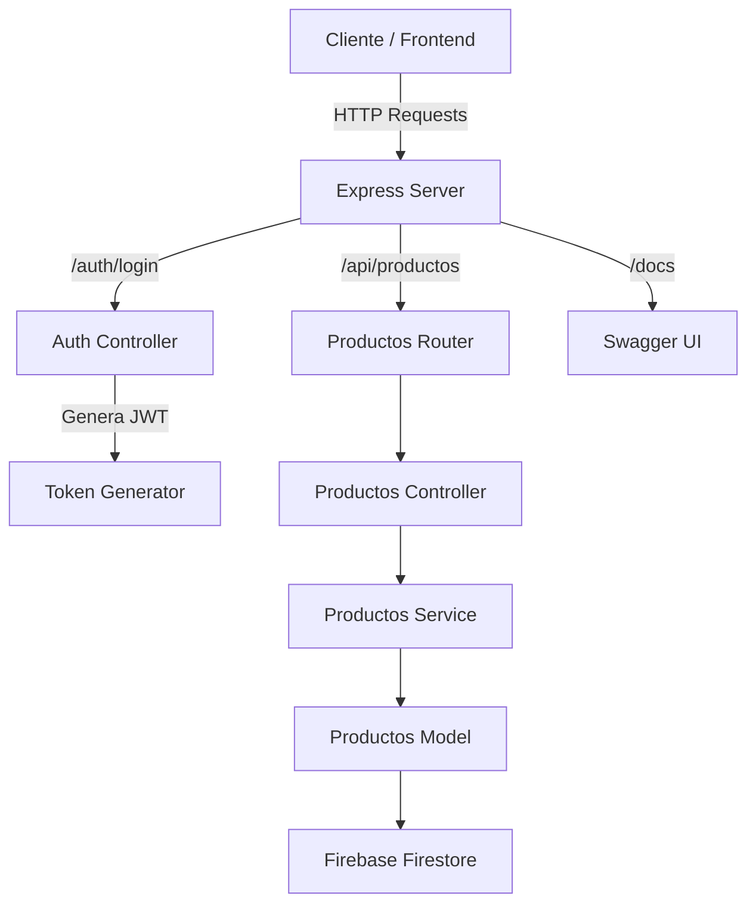

# 🛠 Backend Node.js – API de Productos con Autenticación JWT y Firebase


Sistema backend desarrollado íntegramente por **Nahuel Martínez** con **Node.js** y **Express**, que expone una API REST para la gestión de productos, protegida con autenticación JWT y documentada con Swagger UI.  
La persistencia de datos se realiza en **Firebase Firestore**, y el despliegue está optimizado para **Vercel**.


## 🌐 Documentación en línea

La documentación interactiva de la API está disponible en el siguiente enlace:

🔗 **[Swagger UI – API de Productos](https://back-end-node-js.vercel.app/docs/)**

Desde allí podés explorar todos los endpoints, ver los modelos de datos y probar las peticiones directamente desde el navegador.

---

## 🚀 Características principales

- Autenticación stateless con **JWT** y middleware de verificación.
- **CRUD de productos** sobre Firestore: listar, obtener por ID, crear, eliminar.
- **Swagger UI** en \`/docs\` con especificación generada por \`swagger-autogen\`.
- Despliegue en **Vercel** con configuración para incluir assets de Swagger UI.

---

## 📂 Arquitectura del sistema

```plaintext
src/
├── controllers/        # Lógica de negocio
│   ├── authController.js
│   └── productosController.js
├── data/               # Configuración de Firebase
│   └── data.js
├── middlewares/        # Middlewares de autenticación
│   └── authentication.js
├── models/             # Acceso a datos en Firestore
│   └── productosModels.js
├── routes/             # Definición de endpoints
│   ├── authRoutes.js
│   └── productosRouter.js
├── services/           # Capa de servicios
│   └── productosService.js
└── utils/              # Utilidades
    └── token-generator.js
index.js                # Punto de entrada
swagger.js              # Generación de documentación
swagger-output.json     # Especificación OpenAPI generada
vercel.json             # Configuración de despliegue
```

---

## 📊 Diagrama visual de arquitectura



---

## 🔗 Endpoints

### Autenticación (/auth)
```
POST /auth/login
Body: { "email": "user@ejemplo.com", "password": "OnePiece4321" }
→ Devuelve JWT válido por 1 hora
```

### Productos (/api/productos)
> Requiere header: Authorization: Bearer <token>

```
GET    /api/productos           # Lista todos los productos
GET    /api/productos/:id       # Obtiene un producto por ID
POST   /api/productos           # Crea un nuevo producto
DELETE /api/productos/:id       # Elimina un producto por ID
```

---

## ⚙️ Tecnologías utilizadas

- Node.js + Express
- Firebase Firestore
- JSON Web Tokens (jsonwebtoken)
- Swagger UI Express + swagger-autogen
- Vercel
- dotenv, body-parser, cors

---

## 🖥 Configuración y ejecución

### Prerrequisitos
- Node.js v16+
- Proyecto Firebase con Firestore habilitado
- Archivo .env:
```
FIREBASE_API_KEY=...
FIREBASE_AUTH_DOMAIN=...
FIREBASE_STORAGE_BUCKET=...
FIREBASE_APP_ID=...
MESSAGE_SENDER_ID=...
JWT_SECRET_KEY=...
```

### Instalación
```bash
npm install
```

### Generar documentación Swagger
```bash
npm run swagger
```

### Ejecutar en local
```bash
npm start
```
Servidor: http://localhost:3000  
Swagger UI: http://localhost:3000/docs

---

## 📦 Despliegue en Vercel

`vercel.json`:
```json
{
  "version": 2,
  "builds": [
    {
      "src": "index.js",
      "use": "@vercel/node",
      "config": {
        "includeFiles": "{swagger-output.json,node_modules/swagger-ui-dist/**}"
      }
    }
  ],
  "routes": [
    { "src": "/(.*)", "dest": "index.js" }
  ]
}
```

---

## 👤 Autor

**Nahuel Martínez** – Backend Developer  
GitHub: https://github.com/PiernasNegras  
LinkedIn: https://www.linkedin.com/in/n